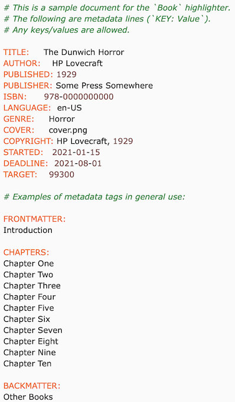
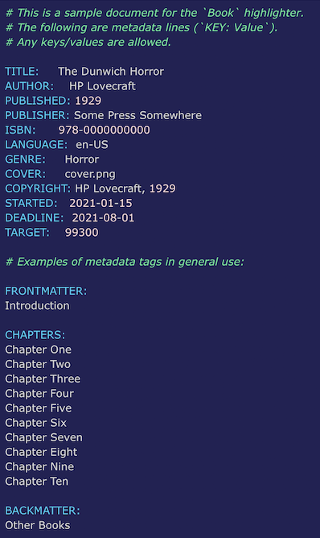
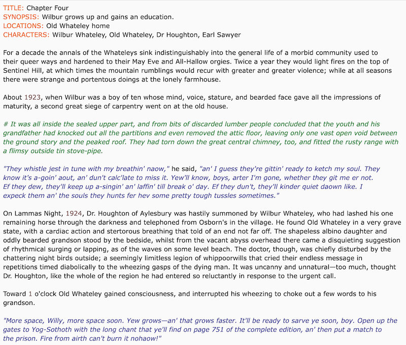
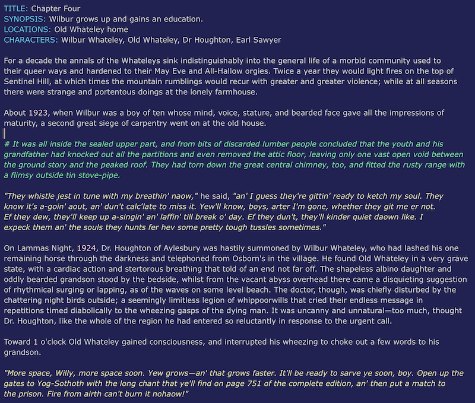

# book-textmate

Prose syntax and theme bundle for TextMate 2 covering metadata, dialogue, and comments.
Includes both a *Book Light* and a *Book Dark* theme.

## Functionality

- See the [example.book](./example.book) file for a sample book definition
- See the [example.chapter](./example.chapter) file for a sample chapter
- Expects filenames with the suffixes `.book`, `.chapter`, or `.scene`
- Provides automatic highlighting of the following:
  - Metadata lines using any prefix of the form `KEY: value` in the leftmost column
  - Comments using the `# comment text` format in the leftmost column
  - Dialogue using standard "double quotes" anywhere in standard text

---

## Example book

See the [example.book](./example.book) file for this sample book definition.

### Light theme

### Dark theme

---

## Example chapter

See the [example.chapter](./example.chapter) file for this sample chapter.

### Light theme

### Dark theme

---

## Installation

- Clone this repository and open it in Finder
- Unzip the bundle, then launch it in TextMate

## Making changes

- Use the `Bundle`, `Edit Bundles` option to make changes
- Option-click the bundle name and `Export` when you've done
